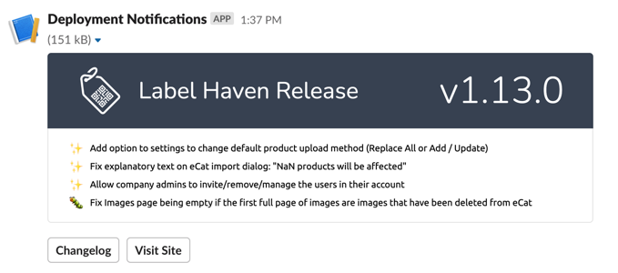

<p align="center"><a href="https://github.com/AdamGaskins/deployed" alt="deployed on Github"></a></p>

<p align="center">An opinionated deployment notification generator for Laravel applications.</p>

<p align="center">
    <a href="https://packagist.org/packages/adamgaskins/deployed" alt="Latest Version on Packagist"></a>
    <a href="https://github.com/adamgaskins/deployed/actions?query=workflow%3ATests+branch%3Amain" alt="GitHub Tests Action Status"></a>
    <a href="https://github.com/AdamGaskins/deployed/blob/main/LICENSE.md"></a>
</p>

## Installation

You can install the package via composer:

```bash
composer require adamgaskins/deployed
```

You should publish the config file so you can customize the buttons sent with the notification:
```bash
php artisan vendor:publish --provider="AdamGaskins\Deployed\DeployedServiceProvider" --tag="deployed-config"
```

Below are the contents of the published config file. You'll want to at least update `vendor/app` in the Changelog path to point to your app, and make sure you have a white, transparent logo PNG uploaded. 

```php
return [
    'links' => [
        'Changelog' => 'https://github.com/vendor/app/blob/v{appVersion}/CHANGELOG.md',
        'Visit Site' => '{appUrl}',
    ],

    'logo' => public_path('img/logo.png'),

    'slack' => [
        'webhook' => env('DEPLOYED_SLACK_WEBHOOK')
    ],

    'default_emoji' => '✨',

    'emojis' => [
        'feature' => '✨',
        'bug' => '🐛',
        'docs' => '📝',
        'tests' => '✅'
    ]
];
```

You'll also want to add a `version` field to your `config/app.php` file. This is how Deployed obtains the version number.

```php
[
    'name' => env('APP_NAME'),
    
    'version' => '1.0.0'
]
```

Finally, add the slack webhook to your `.env` file

```dotenv
DEPLOYED_SLACK_WEBHOOK=https://hooks.slack.com/services/xxx/xxx/xxx
```

## Usage

Run this command after a successful deploy to send a beautiful slack notification with a changelog.

```php
php artisan deployed --notify
```

Deployed will parse the `CHANGELOG.md` in the root of your application. Each version is expected to begin with an h1 and contain a list of changes. For each change in the list, put the type (feature/bug/etc.) in bold at the beginning of the line. Here is an example of a changelog entry that generates the notification at the top of this readme:

```md
### Version 10.3.23
> Released 09/10/2021

- **FEATURE:** Added **Duplicate** button to product editor.
- **BUG:** Deleting a product with no image but with image dimensions specified causes an error.
- **DOCS:** Updated `README.md` to document new deployment steps.
- **TESTS:** Added tests for new **Duplicate** button.

...
```

## Testing

```bash
composer test
```

## License

The MIT License (MIT). Please see [License File](LICENSE.md) for more information.
