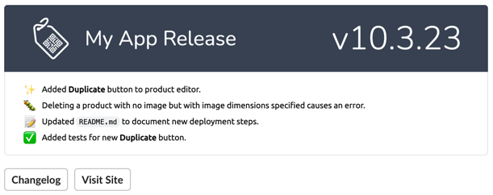

# Deployed

## Installation

You can install the package via composer:

```bash
composer require adamgaskins/deployed
```

You should publish the config file so you can customize the buttons sent with the notification:
```bash
php artisan vendor:publish --provider="AdamGaskins\Deployed\DeployedServiceProvider" --tag="deployed-config"
```

Below are the contents of the published config file. You'll want to at least update `vendor/app` in the Changelog path to point to your app, and make sure you have a white, transparent logo PNG uploaded. 

```php
return [
    'links' => [
        'Changelog' => 'https://github.com/vendor/app/blob/v{appVersion}/CHANGELOG.md',
        'Visit Site' => '{appUrl}',
    ],

    'logo' => public_path('img/logo.png'),

    'slack' => [
        'webhook' => env('DEPLOYED_SLACK_WEBHOOK')
    ],

    'default_emoji' => '✨',

    'emojis' => [
        'feature' => '✨',
        'bug' => '🐛',
        'docs' => '📝',
        'tests' => '✅'
    ]
];
```

Finally, add the slack webhook to your `.env` file

```dotenv
DEPLOYED_SLACK_WEBHOOK=https://hooks.slack.com/services/xxx/xxx/xxx
```

## Usage

Run this command after a successful deploy to send a beautiful slack notification with a changelog:

```php
php artisan deployed --notify
```



## Testing

```bash
composer test
```

## License

The MIT License (MIT). Please see [License File](LICENSE.md) for more information.
